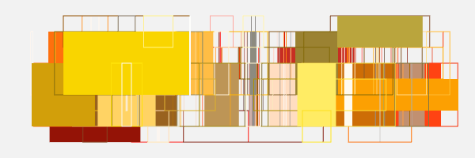

# Ssam

Ssam wraps your HTML5 Canvas sketches and provides helpful features such as animation props and file exports. It is inspired by [`canvas-sketch`](https://github.com/mattdesl/canvas-sketch/).

> ⚠️ This module is in an early stage of development, and there may be unexpected bugs.

## Install

The easiest and quickest way to set up a sketch with Ssam is to use `create-ssam` CLI command. You don't need to install anything (except Node.js of course) in advance. Simply run the command to set up dependencies and bundler and you can jump straight into creative coding:

```sh
npm create ssam@latest
```

The prompts will guide you through selecting a template. See [`create-ssam`](https://github.com/cdaein/create-ssam) for the list of templates.

Alternatively, if you only want to install `ssam` package into your own set up:

```sh
npm install ssam
```

## Features

- **TypeScript**: It can work both in JavaScript or TypeScript projects.
- **ESM**: You can use it alongside other ESM packages.
- **Multiple sketch modes**: It supports vanilla Canvas 2D API, WebGL context, or you can use with other Canvas libraries (Three.js, OGL, Two.js, Pts.js) as long as they support an existing canvas and context. p5.js is not supported (yet).
- **Animation loop**: It has `playhead` prop that repeats `0..1` and makes it easy to create a seamless animation loop. Other props such as `time`, `deltaTime` are provided as well. You can also adjust frame rate for both playing and recording.
- **Sketch settings**: Use `settings` object to reduce boilerplate code in your sketch - set up animation duration, playback frame rate, filename, etc.
- **Sketch props**: Use props for each mode to help your coding.
- **File exports**: Export canvas as image, animated GIF or WebM video at various frame rates using keyboard shortcuts.

## How to

See [documentation](./docs/index.md)

## Example

```js
import { ssam } from "ssam";
import type { Sketch, SketchProps, SketchSettings } from "ssam";

const sketch = ({ wrap, width, height }: SketchProps) => {
  //  setup/init
  const numShapes = 40;
  const colors = [`#aaa`, `blue`, `white`, `black`, `lightpink`];
  const positions: [number, number][] = new Array(numShapes)
    .fill([])
    .map(() => [Math.random() * width, 0]);
  const sizes: [number, number][] = new Array(numShapes)
    .fill(0)
    .map(() => [(Math.random() * width) / 10 + width / 40, height]);

  wrap.render = ({ context: ctx, playhead }: SketchProps) => {
    // animation loop
    ctx.fillStyle = `lightblue`;
    ctx.fillRect(0, 0, width, height);

    positions.forEach((pos, i) => {
      const cycle = Math.sin(i + playhead * Math.PI * 2);
      ctx.beginPath();
      ctx.rect(pos[0] + (cycle * width) / 8, pos[1], ...sizes[i]);
      ctx.fillStyle = colors[i % colors.length];
      ctx.fill();
    });
  };

  wrap.resize = ({ width, height }: SketchProps) => {
    // resize
    console.log(width, height);
  };
};

// sketch settings
const settings: SketchSettings = {
  mode: "2d",
  dimensions: [320, 320],
  pixelRatio: 1,
  duration: 3000,
  playFps: 12,
  exportFps: 12,
  frameFormat: "png",
  framesFormat: "gif",
};

ssam(sketch as Sketch, settings);
```

The code above can create and export the gif:



## License

MIT
